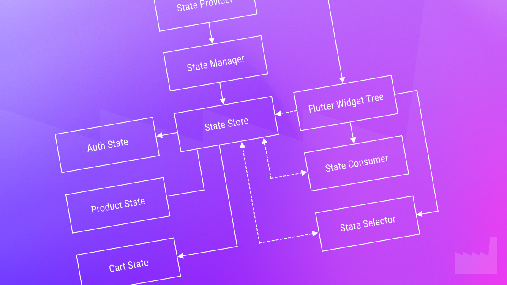
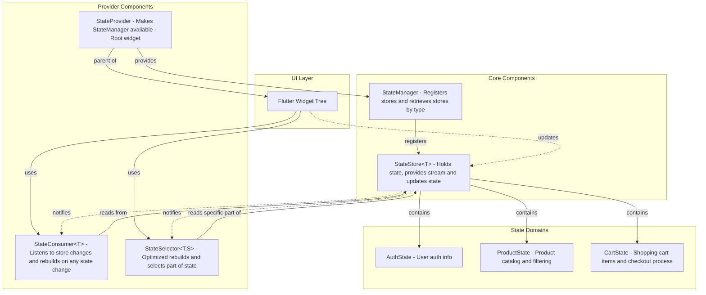

# Custom State Management in Flutter

[](https://github.com/dartfoundry/state_management_example)

## Overview

This project is included in our 4 Part mini-series about state management, and demonstrates how to implement a custom state management solution in Flutter without relying on third-party state management packages. It provides a lightweight, type-safe, and reactive approach to managing application state.

You can read the full series at:
 - [Flutter State Management: Beyond Packages (Part 1)](https://medium.com/dartfoundry/ac3e48fdf24b)
 - [Flutter State Management: Beyond Packages (Part 2)](https://medium.com/dartfoundry/ba29881cdd25)
 - [Flutter State Management: Beyond Packages (Part 3)](https://medium.com/dartfoundry/d3073aebacd2)
 - [Flutter State Management: Beyond Packages (Part 4)](https://medium.com/dartfoundry/4015b05e68d4)

[](https://github.com/dartfoundry/state_management_example)

## Key Features

- **No External State Management Dependencies**: Built using only Flutter's core capabilities
- **Type-Safe**: Fully type-safe state management with generics
- **Reactive**: Stream-based reactivity for efficient UI updates
- **Modular**: Separate state containers for different domains
- **Optimized Rebuilds**: Selectors for granular widget rebuilds
- **Testable**: Clean separation of state from UI

## Architecture

This example implements a custom state management pattern with three
core components:



### 1. StateStore

A generic container that holds state of any type and notifies listeners when the state changes:

```dart
class StateStore<T> {
  // Current state
  T _state;
  final _stateController = StreamController<T>.broadcast();

  // Getters
  T get state => _state;
  Stream<T> get stream => _stateController.stream;

  // Update methods
  void update(T newState) { ... }
  void updateWith(T Function(T currentState) reducer) { ... }
}
```

### 2. StateManager

A centralized registry for all stores in the application:

```dart
class StateManager {
  final Map<Type, StateStore<dynamic>> _stores = {};

  void register<T>(StateStore<T> store) { ... }
  StateStore<T> get<T>() { ... }
}
```

### 3. Provider Components

Widgets that connect the stores to the Flutter widget tree:

- `StateProvider`: Makes stores available throughout the widget tree
- `StateConsumer`: Rebuilds when a store's state changes
- `StateSelector`: Rebuilds only when a specific part of the state changes

## Sample Application

This example implements a small e-commerce application with the following features:

- Product listing with category filtering
- Product details
- Shopping cart management
- Checkout process

## State Organization

The state is divided into three domains:

1. **AuthState**: User authentication information
2. **ProductState**: Product catalog and filtering
3. **CartState**: Shopping cart items and checkout process

## Usage Examples

### Setting Up Stores

```dart
final stateManager = StateManager()
  ..register<AuthState>(StateStore<AuthState>(AuthState()))
  ..register<ProductState>(StateStore<ProductState>(ProductState()))
  ..register<CartState>(StateStore<CartState>(CartState()));
```

### Providing Stores to Widget Tree

```dart
StateProvider(
  stateManager: stateManager,
  child: MaterialApp(
    // app configuration
  ),
)
```

### Consuming State

```dart
StateConsumer<ProductState>(
  builder: (context, state) {
    if (state.isLoading) {
      return CircularProgressIndicator();
    }

    return ListView.builder(
      itemCount: state.products.length,
      itemBuilder: (context, index) => ProductTile(state.products[index]),
    );
  },
)
```

### Optimized Rebuilds with Selectors

```dart
StateSelector<CartState, int>(
  selector: (state) => state.itemCount,
  builder: (context, itemCount) {
    return Text('Items in cart: $itemCount');
  },
)
```

### Updating State

```dart
final cartStore = StateProvider.of<CartState>(context);

void addToCart(Product product) {
  cartStore.updateWith((state) {
    final currentItems = List<CartItem>.from(state.items);
    currentItems.add(CartItem(product: product));
    return state.copyWith(items: currentItems);
  });
}
```

## Key Benefits

1. **Simplicity**: Easier to understand than many third-party solutions
2. **Transparency**: No "magic" - you can see exactly how state flows through your app
3. **Control**: Full control over how and when state updates occur
4. **Performance**: Optimized rebuilds with selectors
5. **Maintainability**: Clear patterns for state updates

## Getting Started

1. Clone this repository
2. Run `flutter pub get`
3. Run `flutter run`

## Implementation Details

The implementation follows these principles:

- **Immutable State**: State classes are immutable with `copyWith` methods
- **Unidirectional Data Flow**: State flows down, actions flow up
- **Single Source of Truth**: Each piece of state has one authoritative source
- **Separation of Concerns**: UI components are decoupled from state logic

## When to Use This Approach

This approach is well-suited for:

- Learning how state management works under the hood
- Projects that need precise control over state updates
- Applications where minimizing dependencies is important
- Teams that prefer explicit patterns over "magical" solutions

For very large or complex applications, you might want to consider established packages like Provider, Riverpod, GetX or Bloc, which offer additional features and optimizations.

## Testing

Our custom state management solution includes a comprehensive test suite that verifies its functionality, reliability, and performance. The test suite covers all major components:

1. **StateStore Tests**: Verify that the core `StateStore` class correctly initializes with initial state, properly updates state through both direct updates and reducer functions, and notifies listeners via its stream.

2. **StateManager Tests**: Ensure that the `StateManager` correctly registers and retrieves stores by type, handles errors for unregistered stores, properly disposes of all registered stores, and maintains state consistency across different store references.

3. **Widget Integration Tests**: Confirm that our UI components (`StateProvider`, `StateConsumer`, and `StateSelector`) integrate properly with the Flutter widget tree. These tests verify that widgets rebuild appropriately when state changes and that `StateSelector` optimizes rebuilds by only triggering them when the selected portion of state changes.

This testing strategy ensures that our state management solution works reliably across different scenarios and use cases. By thoroughly testing both the state containers and their integration with Flutter widgets, we maintain confidence in the solution's robustness as the application evolves.

To run the tests, execute the following command in the terminal:

```sh
flutter test
```

## Copyright

Copyright © 2025 Dom Jocubeit

## License

MIT

---

*This project is for educational purposes to demonstrate custom state management in Flutter.*
